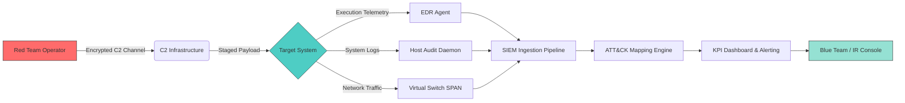
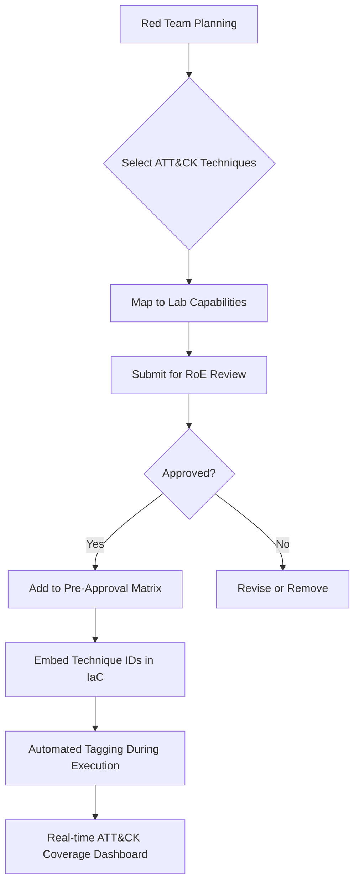

# 🏗️ OPERATION CRIMSON SHIELD: SYSTEM DESIGN DOCUMENT
**Controlled Adversary Simulation Infrastructure**  
*Version 1.0 | Lab-Only Environment | MITRE ATT&CK Aligned*

---

## 📐 1. ARCHITECTURE OVERVIEW

### 1.1 High-Level Logical Architecture

```
┌─────────────────────────────────────────────────────────┐
│                    CONTROL PLANE                         │
│  • Orchestration Engine (Terraform/Ansible)             │
│  • RoE Enforcement & Kill-Switch Controller             │
│  • Immutable Audit Log Forwarder                        │
│  • KPI Dashboard & ATT&CK Navigator Integration         │
└────────────────┬────────────────────────────────────────┘
                 │ HTTPS/API (Strict ACLs)
                 ▼
┌─────────────────────────────────────────────────────────┐
│                 ATTACK INFRASTRUCTURE                    │
│  ┌─────────────────┐  ┌─────────────────┐              │
│  │ C2 Infrastructure│  │ Payload Staging│              │
│  │ • Redirectors   │  │ • Obfuscation  │              │
│  │ • Domain Fronting│ │ • Signing      │              │
│  │ • Malleable C2  │  │ • Versioning   │              │
│  └────────┬────────┘  └────────┬────────┘              │
│           │                    │                        │
│  ┌────────▼────────────────────▼────────┐              │
│  │         RED TEAM OPERATOR STATION     │              │
│  │ • Kali/Parrot OS • Tooling Suite     │              │
│  │ • Session Recording • Evidence Capture│              │
│  └────────┬─────────────────────────────┘              │
└───────────┼────────────────────────────────────────────┘
            │ VLAN-Trunked, ACL-Filtered
            ▼
┌─────────────────────────────────────────────────────────┐
│              TARGET ENVIRONMENT (LAB)                    │
│  ┌─────────────────────────────────────┐               │
│  │        NETWORK SEGMENTATION          │               │
│  │  ┌─────────┐ ┌─────────┐ ┌────────┐ │               │
│  │  │ DMZ Zone│ │Internal │ │Secure  │ │               │
│  │  │• Web Srv│ │• AD DC  │ │• DB/Fin│ │               │
│  │  │• Proxy  │ │• Workstations│ │• PII Sim│ │       │
│  │  └────┬────┘ └────┬────┘ └────┬───┘ │               │
│  │       │          │          │      │               │
│  │  ┌────▼──────────▼──────────▼────┐ │               │
│  │  │   SHARED SERVICES LAYER       │ │               │
│  │  │ • DNS • DHCP • NTP • Logging  │ │               │
│  │  └───────────────────────────────┘ │               │
│  └────────────────────────────────────┘               │
└────────────────┬───────────────────────────────────────┘
                 │ Telemetry Forwarding (Syslog/CEF)
                 ▼
┌─────────────────────────────────────────────────────────┐
│              MONITORING & DETECTION LAYER                │
│  • SIEM (Elastic/Splunk Lab) • EDR Telemetry Agent      │
│  • Network Tap/SPAN • Host-Based Auditd/Sysmon          │
│  • ATT&CK Detection Mapping Engine                      │
└─────────────────────────────────────────────────────────┘
```

### 1.2 Physical/Cloud Deployment Model [[44]]
| Layer | Technology | Purpose | Isolation Control |
|-------|-----------|---------|------------------|
| **Orchestration** | Terraform + AWS/Azure or Proxmox On-Prem | IaC provisioning, snapshot management | Dedicated management VPC/VLAN, MFA-enforced API access |
| **Attack Infra** | Isolated VPC/VLAN (10.10.0.0/24) | C2, payload staging, operator access | No route to target env except via approved pivot points; egress filtered to allow only lab-internal traffic |
| **Target Env** | Multi-VLAN AD Lab (10.20.0.0/16) | Simulated corporate network with intentional misconfigurations [[44]] | Inter-VLAN routing controlled by stateful firewall; default-deny policy; logging all cross-segment traffic |
| **Monitoring** | Dedicated SIEM/EDR VLAN (10.30.0.0/24) | Telemetry aggregation, alerting, KPI tracking | Read-only access to target logs; no command/control capability over target systems |
| **Audit/Storage** | Immutable WORM Storage (S3 Object Lock / On-Prem WORM) | Evidence preservation, chain-of-custody | Write-once, read-many; cryptographic hashing; access logged to separate audit trail |

> 🔒 **Critical Design Principle**: Air-gap simulation via strict ACLs, not just VLANs. All inter-zone traffic must traverse a logged, policy-enforced firewall [[21]][[27]].

---

## ⚙️ 2. COMPONENT DESIGN SPECIFICATIONS

### 2.1 Attack Infrastructure Components
| Component | Tool/Technology | Configuration Notes | ATT&CK Alignment |
|-----------|----------------|-------------------|-----------------|
| **C2 Framework** | Sliver / Covenant / Mythic (lab-approved) | Malleable C2 profiles mimicking legitimate traffic; domain fronting via internal DNS redirectors | Command & Control (T1071, T1573) |
| **Payload Staging** | Private GitLab + HashiCorp Vault | Signed payloads; versioned releases; hash-verified deployment | Defense Evasion (T1027), Resource Development (T1583) |
| **Operator Station** | Kali Linux (immutable VM snapshot) | Pre-loaded tooling: Impacket, BloodHound, Certipy, custom scripts; session recording via `script` + auditd | Execution (T1059), Discovery (T1082) |
| **Redirector Chain** | Nginx + Apache + CloudFront (lab-mocked) | Traffic shaping to mimic legitimate SaaS patterns; TLS 1.3 enforced | Command & Control (T1090, T1572) |

### 2.2 Target Environment Components [[6]][[44]]
| Component | Configuration | Intentional Weaknesses (for testing) | Detection Opportunity |
|-----------|--------------|-------------------------------------|---------------------|
| **Active Directory** | Windows Server 2022 DCs; 2-tier OU structure | • LAPS not enforced on all workstations<br>• Over-permissive service accounts<br>• Kerberoastable accounts | Account Discovery (T1087), Valid Accounts (T1078) |
| **Workstations** | Windows 10/11 Enterprise (domain-joined) | • WDAC/AppLocker not fully deployed<br>• PowerShell logging partially enabled<br>• Local admin reuse | Defense Evasion (T1562), Execution (T1059.001) |
| **Servers** | Linux (Ubuntu 22.04) + Windows Server | • Unpatched CVE-2023-XXXX (lab-safe)<br>• Misconfigured sudoers<br>• World-readable config files | Exploitation (T1212), Privilege Escalation (T1068) |
| **Network Services** | Internal DNS, DHCP, NTP, Syslog | • DNS zone transfers enabled internally<br>• Unauthenticated syslog ingestion | Discovery (T1016, T1046) |

### 2.3 Monitoring & Telemetry Stack [[33]][[37]]
```yaml
siem_layer:
  platform: "Elastic Stack (Lab) or Splunk Free"
  ingestion:
    - "Windows Event Logs (Security, Sysmon, PowerShell)"
    - "Linux auditd + journald"
    - "Network Flow (NetFlow/IPFIX from virtual switch)"
    - "EDR Telemetry (OSQuery/Wazuh agent)"
  detection_engine:
    - "Sigma rules mapped to ATT&CK techniques"
    - "Custom YARA for lab-specific payloads"
    - "Behavioral analytics: process tree anomaly detection"
  alerting:
    - "Severity-based routing to IR ticketing (lab Jira)"
    - "MTTD/MTTR timestamp injection for KPI tracking"

edr_layer:
  agent: "Wazuh (open-source) or Elastic Agent"
  capabilities:
    - "Real-time file integrity monitoring"
    - "Process execution logging with command-line capture"
    - "Network connection monitoring per process"
    - "Registry/key persistence detection (Windows)"
  telemetry_forwarding: "TLS-encrypted to SIEM; local buffer on agent failure"

network_monitoring:
  tap_points: "Virtual switch SPAN ports on all inter-VLAN links"
  tools:
    - "Zeek (Bro) for protocol analysis"
    - "Suricata (lab ruleset) for signature-based detection"
    - "Arkime for full packet capture (7-day retention)"
```

---

## 🔗 3. DATA FLOW & INTEGRATION ARCHITECTURE

### 3.1 Attack Execution Data Flow


### 3.2 Evidence Collection & Chain-of-Custody
| Data Type | Collection Method | Storage | Verification |
|-----------|------------------|---------|-------------|
| **Command Execution Logs** | Operator station `script` + auditd | Immutable WORM bucket | SHA-256 hash + timestamp signed by HSM (lab mock) |
| **Network PCAP** | Arkime capture on SPAN ports | Encrypted object storage (AES-256) | MD5 hash stored in separate audit log |
| **EDR Telemetry** | Agent-forwarded JSON over TLS | SIEM hot/warm/cold tiers | Sequence numbers + replay detection |
| **Screenshots/Evidence** | Red team tooling with metadata injection | Evidence repository with access logging | Digital signature + operator ID binding |
| **ATT&CK Mapping** | Automated tagging via CAR/Atomic Red Team | ATT&CK Navigator layer export | Versioned JSON with technique ID validation |

> ✅ **Compliance Note**: All evidence collection follows NIST SP 800-86 guidelines for forensic soundness, adapted for lab simulation context.

---

## 🛡️ 4. SECURITY CONTROLS & ISOLATION MECHANISMS

### 4.1 Network Isolation Controls [[21]][[27]][[29]]
```bash
# Example: Firewall Policy (Pseudo-Code) for Inter-VLAN Traffic
policy inter_vlan {
  source_vlan = "ATTACK_INFRA"
  dest_vlan = "TARGET_INTERNAL"
  
  # Default: DENY ALL
  default_action = "DROP";
  log_dropped = true;
  
  # Approved Attack Vectors (Pre-Authorized in RoE)
  allow if {
    protocol = "TCP" AND
    dest_port IN [445, 3389, 5985] AND  # SMB, RDP, WinRM (lab-approved)
    source_ip IN [10.10.0.50, 10.10.0.51] AND  # Only operator stations
    time_window = "09:00-17:00 UTC" AND  # Time-boxed execution
    technique_id IN ["T1021.002", "T1021.001"]  # ATT&CK pre-approval
  }
  
  # Auto-Block on Anomaly Detection
  block if {
    packet_rate > 1000/sec OR
    payload_entropy > 7.8 OR  # Potential encrypted C2
    destination_port NOT IN approved_list
  }
}
```

### 4.2 Kill-Switch & Rollback Protocol
| Trigger Condition | Automated Response | Manual Override |
|------------------|-------------------|----------------|
| **Unauthorized technique execution** | Immediately terminate C2 sessions; isolate attacker VLAN | Red Team Lead + Security Officer dual-approval required to resume |
| **Target system instability** | Revert to last-known-good VM snapshot (hourly) | Blue Team can trigger emergency rollback via dedicated API |
| **Evidence integrity failure** | Halt all operations; seal audit logs; alert compliance officer | Requires forensic review before engagement continuation |
| **RoE violation detected** | Full environment quarantine; preserve state for investigation | Legal/Compliance sign-off required for any action |

### 4.3 Access Control & Authentication
```yaml
rbac_model:
  roles:
    red_team_operator:
      permissions: ["execute_approved_techniques", "capture_evidence", "view_own_logs"]
      mfa_required: true
      session_timeout: 30min
    blue_team_analyst:
      permissions: ["view_all_telemetry", "create_alerts", "update_playbooks"]
      mfa_required: true
      read_only_target_access: true
    compliance_officer:
      permissions: ["audit_all_actions", "approve_roe_changes", "seal_evidence"]
      mfa_required: true
      no_target_access: true
  
  authentication:
    primary: "Certificate-based mutual TLS + TOTP"
    fallback: "Hardware token (YubiKey) for emergency access"
    logging: "All auth attempts logged to immutable audit store"
```

---

## 🔄 5. SCALABILITY & REPRODUCIBILITY DESIGN

### 5.1 Infrastructure-as-Code (IaC) Strategy [[44]]
```hcl
# Terraform Module Structure (Simplified)
module "crimson_shield_lab" {
  source = "./modules/lab-core"
  
  # Environment Parameters
  environment_name = var.engagement_id  # e.g., "CS-2026-Q1-003"
  isolation_level  = "strict"           # strict / moderate / permissive (lab-only)
  
  # Target Environment Scaling
  target_vms = {
    domain_controllers = 2
    workstations       = 10
    servers            = 5
    network_devices    = 3  # virtual firewalls/routers
  }
  
  # Monitoring Configuration
  siem_config = {
    retention_days = 90
    attck_mapping  = true
    kpi_injection  = true
  }
  
  # Safety Controls
  safety = {
    snapshot_frequency = "1h"
    auto_rollback_on_error = true
    network_acl_template = "lab-strict-v1"
  }
}
```

### 5.2 Reproducibility & Versioning
| Artifact | Versioning Strategy | Validation Method |
|----------|-------------------|------------------|
| **Target VM Images** | Golden image + Packer build pipeline; semantic versioning (v1.2.3) | InSpec tests [[44]] to validate configuration pre-deployment |
| **Attack Tooling** | Containerized (Docker) with pinned dependencies; SHA-256 verified | Hash verification + sandbox execution test |
| **Detection Rules** | Sigma rule repository with technique mapping; PR review required | Atomic Red Team tests to validate detection coverage |
| **ATT&CK Mapping** | Navigator layer JSON with technique version pinning | Automated validation against MITRE ATT&CK API |
| **Engagement Config** | GitOps workflow; RoE document hash embedded in deployment manifest | Dual-signature approval (Red Lead + Compliance) |

> 🎯 **Key Metric**: Full environment rebuild time ≤ 45 minutes from IaC execution to ready state.

---

## 🎯 6. MITRE ATT&CK INTEGRATION & MAPPING

### 6.1 Technique Selection & Pre-Approval Workflow


### 6.2 Detection Coverage Measurement Framework [[12]][[14]]
| ATT&CK Tactic | Lab Techniques Tested | Detection Method | Coverage Metric |
|--------------|----------------------|-----------------|----------------|
| **Initial Access** | T1190 (Exploit Public App), T1566 (Phishing-lab) | SIEM correlation rules + EDR process monitoring | % of attempts generating alert within 5 min |
| **Execution** | T1059.001 (PowerShell), T1204.002 (Malicious File) | Command-line logging + script block logging | Alert fidelity score (FP/FN ratio) |
| **Persistence** | T1053.005 (Scheduled Task), T1547.001 (Registry Run) | FIM + registry monitoring + EDR persistence scan | Mean time to detect persistence mechanism |
| **Privilege Escalation** | T1068 (Exploitation), T1548.002 (Sudo) | Auditd + privilege change alerts | Successful escalation vs. detection rate |
| **Lateral Movement** | T1021.002 (SMB), T1570 (RDP) | Network flow analysis + authentication logs | Cross-segment movement detection latency |
| **Defense Evasion** | T1027 (Obfuscation), T1562.001 (Disable Logging) | Integrity monitoring + process behavior analytics | Evasion success rate vs. detection coverage |

> 📊 **Coverage Dashboard**: Real-time ATT&CK Navigator layer updated with:  
> - ✅ Detected (with timestamp & alert ID)  
> - ⚠️ Partially Detected (telemetry present, no alert)  
> - ❌ Undetected (requires rule tuning)  
> - 🚫 Not Tested (outside scope)

---

## 🚀 7. DEPLOYMENT & OPERATIONS RUNBOOK

### 7.1 Pre-Engagement Checklist
```markdown
- [ ] RoE document signed by all stakeholders (legal, security, asset owners)
- [ ] IaC deployment validated in staging environment
- [ ] All VM snapshots taken pre-engagement (hourly baseline)
- [ ] Monitoring stack health check: SIEM ingestion, EDR agent status, network tap flow
- [ ] Kill-switch test: Verify automated rollback triggers function
- [ ] Evidence chain-of-custody workflow validated (hash generation, storage, access logging)
- [ ] Blue team briefed on simulation schedule & expected alert volume
- [ ] ATT&CK pre-approval matrix loaded into detection engine
```

### 7.2 During-Engagement Monitoring
| Metric | Tool | Alert Threshold | Response |
|--------|------|----------------|----------|
| **Environment Stability** | Proxmox/AWS Health Checks | CPU >90% for 5min OR disk I/O spike | Auto-throttle attack tools; alert Red Lead |
| **Detection System Health** | SIEM/EDR heartbeat monitoring | Agent offline >2min OR ingestion lag >5min | Failover to backup collector; pause engagement if critical |
| **RoE Compliance** | Technique execution logger | Unauthorized technique ID detected | Immediate kill-switch activation; preserve state |
| **Evidence Integrity** | Hash verification daemon | Hash mismatch on new evidence file | Quarantine file; alert compliance officer |

### 7.3 Post-Engagement Teardown
```bash
# Automated Teardown Script (Pseudo-Code)
#!/bin/bash
engagement_id=$1

# 1. Seal evidence repository
evidence_seal --engagement $engagement_id --sign-with-hsm

# 2. Export final ATT&CK coverage report
attck_navigator export --layer final --output ./reports/$engagement_id-attck-layer.json

# 3. Revert target environment to pre-engagement snapshot
terraform state pull | jq '.resources[] | select(.type=="vsphere_virtual_machine")' | \
  xargs -I {} vsphere_vm_revert --id {} --snapshot "pre-engagement-baseline"

# 4. Destroy attack infrastructure (preserve logs)
terraform destroy -target=module.attack_infra -auto-approve

# 5. Generate KPI summary
kpi_calculator --engagement $engagement_id --output ./reports/$engagement_id-kpis.json

# 6. Archive immutable logs to long-term WORM storage
log_archiver --source /var/log/crimson_shield/ --destination s3://worm-audit/$engagement_id/
```

---

## 📋 8. APPENDIX: TECHNOLOGY STACK REFERENCE

| Category | Recommended Tools (Lab-Approved) | Alternative Options |
|----------|--------------------------------|-------------------|
| **Orchestration** | Terraform Cloud (lab instance), Ansible Tower (self-hosted) | Pulumi, SaltStack |
| **Virtualization** | Proxmox VE (on-prem), AWS EC2 + VPC (cloud lab) | VMware vSphere, Azure Lab Services |
| **C2 Framework** | Sliver (open-source), Covenant (.NET) | Mythic, Brute Ratel (commercial, lab license) |
| **Target OS** | Windows Server 2022, Windows 10/11, Ubuntu 22.04 LTS | RHEL 9, Debian 12 (for diversity testing) |
| **SIEM** | Elastic Stack (free tier), Splunk Free | Wazuh + OpenSearch, Graylog |
| **EDR/Telemetry** | Wazuh agent, Elastic Agent, OSQuery | Velociraptor (for advanced collection) |
| **Network Monitoring** | Zeek, Suricata, Arkime | Security Onion, Moloch |
| **Evidence Mgmt** | HashiCorp Vault (lab), MinIO with WORM | AWS S3 Object Lock, on-prem WORM appliance |
| **ATT&CK Tooling** | MITRE ATT&CK Navigator, Atomic Red Team, CAR | Caldera (for automated emulation), PyATT&CK |

> ⚠️ **Tooling Policy**: All tools must be:  
> 1. Scanned for malware/backdoors pre-deployment  
> 2. Run in containerized/isolated environments  
> 3. Configured with lab-specific, non-malicious payloads  
> 4. Logged to immutable audit trail  

---

## ✅ FINAL DESIGN VALIDATION CHECKLIST

- [x] **Isolation**: No route from attack infra to production; all lab traffic contained  
- [x] **Reversibility**: Hourly snapshots + automated rollback capability  
- [x] **Auditability**: All actions logged to immutable, hash-verified storage  
- [x] **ATT&CK Alignment**: Technique mapping embedded in IaC and detection pipeline  
- [x] **KPI Integration**: MTTD/MTTR injection points in telemetry flow  
- [x] **Ethical Safeguards**: RoE enforcement engine + dual-approval kill-switch  
- [x] **Scalability**: IaC supports 1–50 concurrent target environments  
- [x] **Reproducibility**: Golden images + InSpec validation ensure consistent baselines  

---

> 🎯 **Operation CRIMSON SHIELD System Design Complete**  
> *Next Step*: Proceed with IaC deployment to staging environment for validation testing.  
> *Approval Required*: Red Team Lead, Security Architect, Compliance Officer sign-off before production lab deployment.

*This design document is classified: INTERNAL USE ONLY – CONTROLLED LAB ENVIRONMENT. Distribution outside authorized personnel prohibited.*
